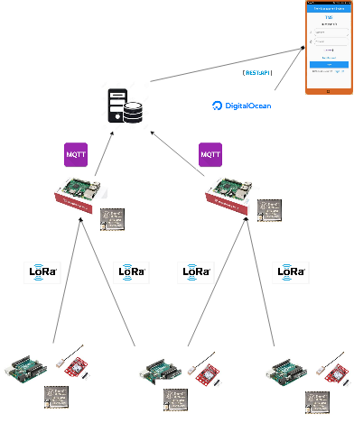
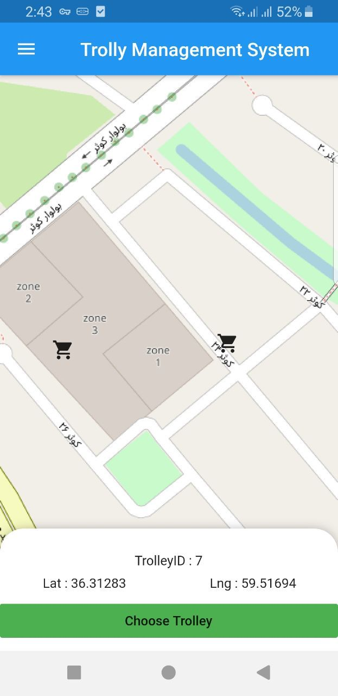
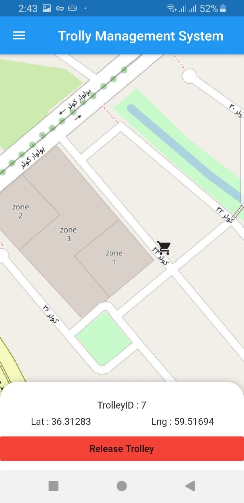

# Airport-Trolly-managment
TMS is a mobile application for managing and tracking the airport's trollies, which helps passengers find trollies as fast as possible. Moreover, it can help the staff to manage and track each trolley and its status.

## Some of the features of this application:
* Users can see the state of available trollies on the provided map of that airport and reserve them before they reach the desired location in that airport.

* The application can be used for the staff to track each trolley and see its location so it can be useful for managing trollies.

* Also, there is a management panel website that can be used to track and find more details of the trollies and the users.

## System architecture
</img>
 
 

## The monbile application 

</img>
</img>

